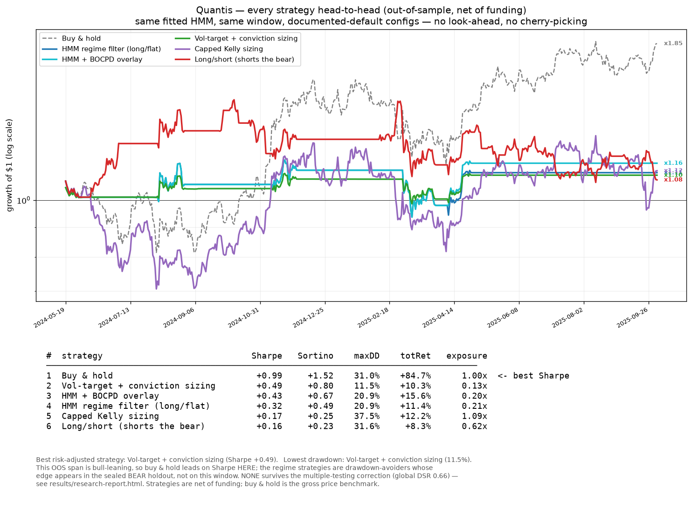
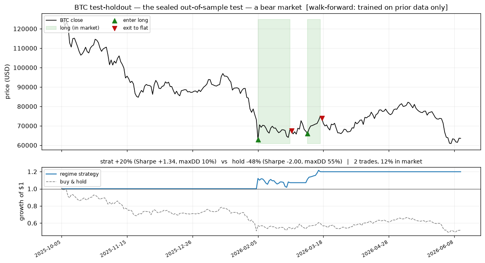
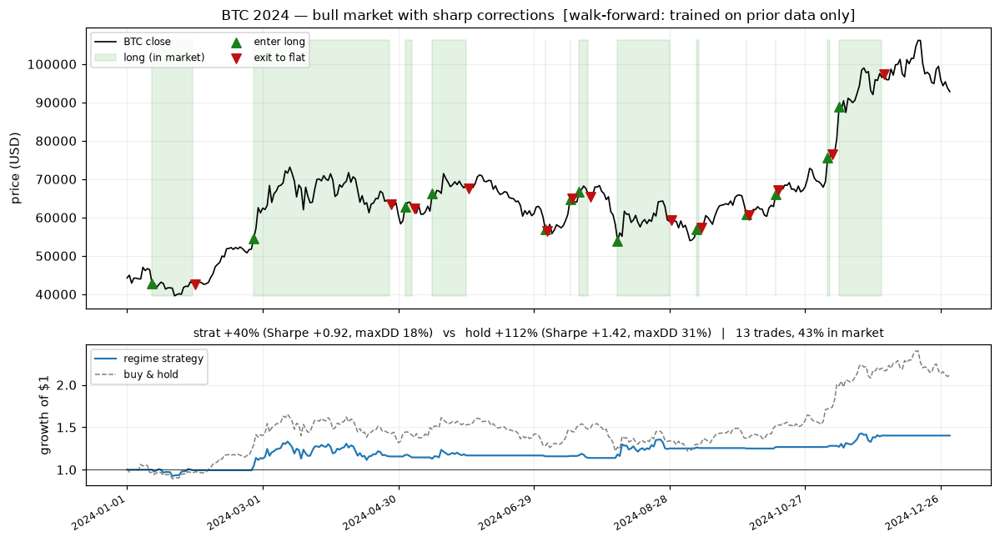
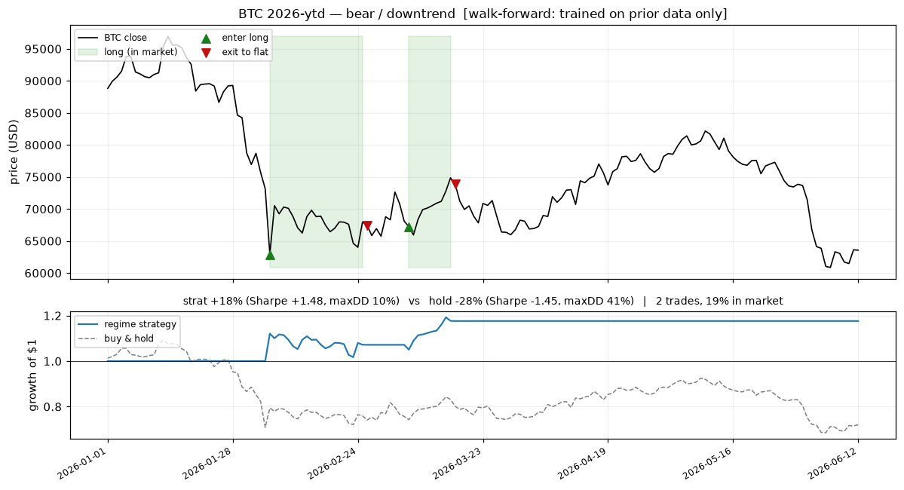
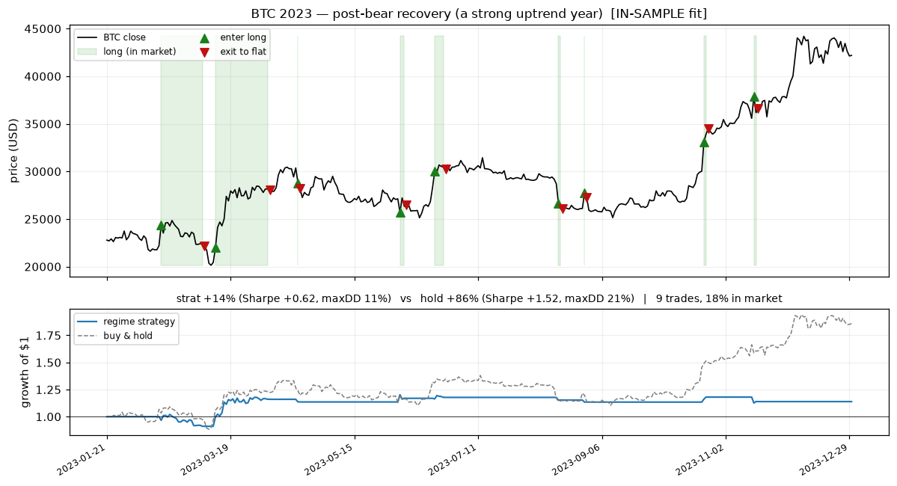
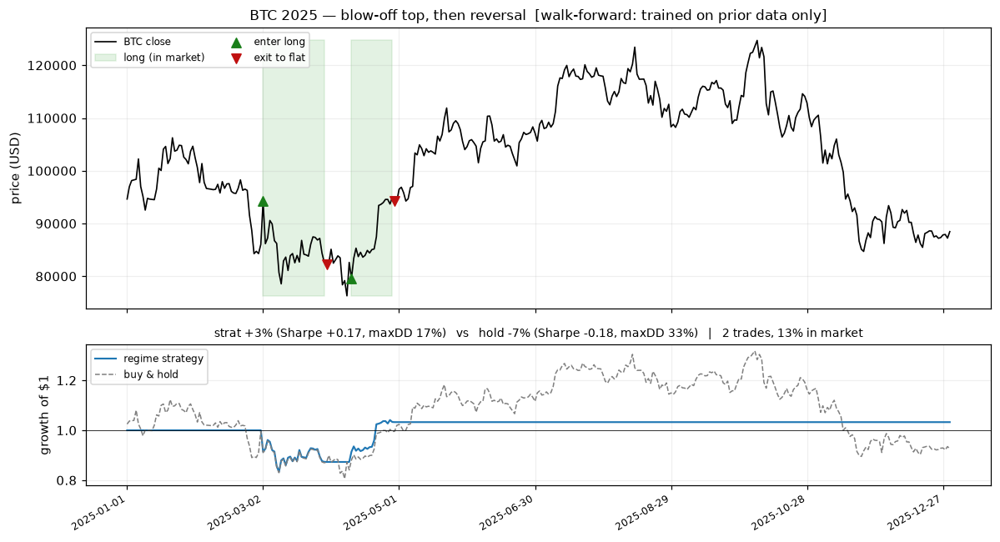

# Quantis

[](https://github.com/oscartiz/quantis/actions/workflows/ci.yml)
[](LICENSE)


A research-to-execution engine for regime-switching strategies on Hyperliquid
perpetual futures: a Rust hot path (market-data ingestion, order-book
reconstruction, event-driven backtesting, paper/testnet execution) under a
Python research layer (feature pipelines, regime models, statistically honest
evaluation), sharing one matching engine so backtests and live paper trading
cannot disagree about fill logic.

> ⚠️ **Safety posture.** Quantis is research software, not financial advice,
> and trading perpetual futures carries substantial risk of loss. This
> codebase trades **paper/testnet only**: `mode = "mainnet"` is rejected at
> the configuration layer by design, and there is intentionally no flag to
> bypass it. Secrets never enter the repo — keys live in environment
> variables or gitignored config, enforced by a pre-commit secret scan.

## Why this exists

- **One matching engine.** The backtester's fill logic *is* the paper
  trader's fill logic (`crates/backtest`, consumed by `crates/execution`).
  Backtest/live divergence can then only come from data and latency — which
  gets measured and reported, not hidden.
- **Statistical honesty as a feature.** Purged walk-forward CV with embargo,
  leakage canary tests, multiple-testing corrections (Deflated Sharpe, SPA)
  over the *logged* trial history, and a holdout set evaluated exactly once.
  A standing [`docs/losing-money.md`](docs/losing-money.md) explains what would
  lose money in production and why.
- **A measured language boundary.** Rust is used where benchmarks justify it,
  not where it is fashionable; [ADR-002](docs/adr/ADR-002-rust-python-boundary.md)
  records the Rust event loop at ~14M events/s, ~34× an equivalent Python loop.

## The honest result

The out-of-sample holdout — last 20% of the candle history, **sealed and
hashed before evaluation, evaluated exactly once** — covered a bear market
(Oct 2025 → Jun 2026). The causal regime strategy returned **+19.9% at 13%
exposure (Sharpe +1.40, max drawdown 9.5%)** while buy-and-hold lost −42.7%
(Sharpe −1.84, 50.6% drawdown). Read honestly: that is N = 1 in exactly the
risk-off environment the strategy is built for — in the bull-dominated
*in-sample* period it **trailed** buy-and-hold (Sharpe 0.32 vs 0.65). This is a
risk-reducing regime filter, not a demonstrated edge, and the credibility is in
the discipline that produced the number — see
[docs/statistical-honesty.md](docs/statistical-honesty.md).

Two later stress tests only sharpen this. Netting in **real Hyperliquid funding**
(hash-pinned `data/sample/btc-funding.csv`) leaves the low-exposure holdout
essentially unchanged (**+19.8%**) but trims the broader walk-forward edge
(pooled Sharpe **0.60 → 0.42**); and running the repo's *own* Deflated-Sharpe +
SPA over an **18-config search** finds **no edge that survives the
multiple-testing correction** (best PSR 0.94 → **DSR 0.61**, SPA-vs-cash p 0.44).
The honest synthesis: an *episodic, regime-specific drawdown filter*, not a
*general, searchable* alpha. Reproduce with `scripts/evaluate_funding_impact.py`
and `scripts/regime_search.py`.

The same discipline disciplines the project's *own* new ideas. Putting the repo's
second regime model to work — BOCPD as a fast, causal risk-off overlay on the HMM
filter ([ADR-007](docs/adr/ADR-007-hmm-bocpd-ensemble.md)) — measurably trims
drawdown on a single split (max-DD 20.9% → 13.7%, Sharpe +0.32 → +0.53), but
across a 9-variant search it too shows **no edge that survives deflation** (DSR
0.68, SPA-vs-HMM p 0.36): the overlay reshapes risk, exactly as designed, without
adding searchable alpha. Reproduce with `scripts/ensemble_eval.py`.

The discipline now spans four searches and one global correction, and the verdict
only sharpens. **Sizing** the book — volatility targeting, conviction weighting,
and capped fractional Kelly, a causal port of the risk crate's own sizers
([ADR-008](docs/adr/ADR-008-research-position-sizing.md)) — lifts single-split
Sharpe (best +0.60) and improves walk-forward consistency, but no variant survives
its 16-config deflation. **Shorting** the bear regime
([ADR-010](docs/adr/ADR-010-long-short-regime-trading.md)), despite a funding
tailwind a short collects, *degrades* the out-of-sample distribution (pooled
Sharpe 0.25 → 0.03) and is left opt-in. A new overfitting diagnostic — CSCV's
**Probability of Backtest Overfitting** ([ADR-009](docs/adr/ADR-009-overfitting-diagnostics.md))
— flags the overlay (PBO 0.92) and long/short (0.77) searches as fragile. And the
capstone, a **global correction** that pools **all 52 trials across every study**,
deflates the best configuration found *anywhere* to a **global Deflated Sharpe of
0.66 — no edge survives**. Reproduce the whole story with `make research` →
`results/research-report.html`.

## Every strategy, head-to-head

One picture, all six strategies on the *same* out-of-sample window, the *same*
fitted HMM, **net of funding**, each at its documented-default config (no
look-ahead, no cherry-picking). Generated by `scripts/compare_strategies.py`.



| Rank | Strategy | Sharpe | max DD | total ret | exposure |
|---|---|---:|---:|---:|---:|
| 1 | **Buy & hold** (benchmark) | **+0.99** | 31.0% | +84.7% | 1.00× |
| 2 | **Vol-target + conviction sizing** | +0.49 | **11.5%** | +10.3% | 0.13× |
| 3 | HMM + BOCPD overlay | +0.43 | 20.9% | +15.6% | 0.20× |
| 4 | HMM regime filter (long/flat) | +0.32 | 20.9% | +11.4% | 0.21× |
| 5 | Capped Kelly sizing | +0.17 | 37.5% | +12.2% | 1.09× |
| 6 | Long/short (shorts the bear) | +0.16 | 31.6% | +8.3% | 0.62× |

Read honestly: this OOS span is bull-leaning, so **buy & hold wins here** — a
long-only-in-bull filter is *built* to trail a rising market. Among the
strategies, **vol-target + conviction sizing** is both the best risk-adjusted
(Sharpe +0.49) and the lowest-drawdown (11.5%) at one-eighth the exposure. But
the strategies' real job is downside protection: on the sealed **bear** holdout
the regime filter held cash through the crash (+20% vs −48%, [above](#the-honest-result)).
And — the point of the whole exercise — **none of them survives the
multiple-testing correction**.

## How the model behaves across market regimes

To see *what the model actually does*, here are its trades on BTC across
different kinds of years. Every chart is generated **walk-forward** — the HMM is
fit only on data *strictly before* each window, then the causal (filtered)
regime signal trades through it, with no look-ahead. Green shading = the model
is long (in the market); ▲ / ▼ mark entries and exits. Reproduce with
`uv run --project python python python/scripts/regime_charts.py`.

| Window | Market type | Strategy | Buy & hold | Sharpe | Trades | In market |
|---|---|---:|---:|---:|---:|---:|
| **Holdout test** (Oct 2025–Jun 2026) | bear (the *pre-registered* test) | **+20%** | −48% | +1.34 | 2 | 12% |
| 2023 | post-bear recovery (strong uptrend) | +14% | +86% | +0.62 | 9 | 18% |
| 2024 | bull with sharp corrections | +40% | +112% | +0.92 | 13 | 43% |
| 2025 | blow-off top, then reversal | +3% | −7% | +0.17 | 2 | 13% |
| 2026 YTD | bear / downtrend | +18% | −28% | +1.48 | 2 | 19% |

### The test: the sealed bear-market holdout



This is the one **pre-registered** test (boundary + hash committed before
evaluation). BTC fell from ~$120k to ~$60k. The model held **cash through almost
the entire crash** — it never saw a bull regime to enter — then took two long
positions near the February 2026 bottom that caught the relief bounces. Result:
**+20% while buy-and-hold lost 48%.** Exactly what a regime risk-filter should
do in a downturn, and a clean demonstration that the causal signal carries no
look-ahead (it entered *after* the bottom formed, not before).

### Exploring different years

| Bull market — gives up most of the upside | Bear/down — its best environment |
|---|---|
|  |  |

- **2023 — recovery (+86% hold, model +14%).** BTC climbed off the 2022 bottom.
  The model held only 18% of the time and captured a *fraction* of the rally:
  regime models are **late to a new bull**, because early-uptrend days still
  look like the prior bear/chop to a freshly-calibrated model. *(In-sample fit —
  no prior data — and excludes the first ~3 weeks used for feature warmup.)*
- **2024 — bull with corrections (+112% hold, model +40%).** ETF inflows and the
  halving drove a volatile rally. The model traded actively (13 round trips, 43%
  in market) and made a solid +40% — but its in-and-out behavior during every
  20–30% correction left **most of the upside on the table** (chart, right-hand
  column above: the blue strategy curve steadily detaches below grey buy-and-hold).
- **2025 — top then reversal (−7% hold, model +3%).** A choppy, topping year.
  The model sat out most of it (13% in market) and ended roughly flat — neither
  hero nor villain, sidestepping the churn.
- **2026 YTD — bear (−28% hold, model +18%, Sharpe +1.48).** The model at its
  best: flat through the decline, two well-timed bounce trades, positive return
  while the market fell.




### What this says about the model

The pattern is consistent and, importantly, *not cherry-picked* — it holds
across every market type: **this is a drawdown-avoider, not a return-maximizer.**
It beats buy-and-hold decisively in down and choppy years (holdout, 2025, 2026)
and trails it badly in up years (2023, 2024), because being long only in
*confirmed, causal* bull regimes means it is structurally late entering rallies
and quick to step aside in corrections. Over a full cycle this nets to modest
*risk-adjusted* outperformance (walk-forward pooled Sharpe **0.60 vs 0.20**),
earned almost entirely by **not losing in the bad years** — at the cost of
leaving most bull-market gains behind. Whether that trade-off is attractive
depends entirely on the mandate: compelling for a drawdown-sensitive book,
frustrating for anyone trying to capture BTC's upside. The model does exactly
one thing well — *get out of the way of declines* — and the charts let you see
it do precisely that, and nothing more.

> Caveats, stated up front: only the holdout is pre-registered; the yearly
> windows are exploratory (but still causal / no-look-ahead). Daily bars, single
> asset, a deliberately simple long/flat rule, and the BTC narrative (halving,
> ETFs) is context I added — the model knew none of it, only returns and
> volatility.

## Status — all phases complete

| Phase | Scope | State |
|-------|-------|-------|
| 0 | Scaffolding, fail-closed config system, CI, secret scanning | ✅ done |
| 1 | WS ingestion, order book, backtest core, benchmarks, sample data | ✅ done |
| 2 | PyO3 bindings, feature pipeline, Gaussian HMM vs. BOCPD, purged CV | ✅ done |
| 3 | Realistic fills (fees, latency, funding), risk layer, DSR/SPA | ✅ done |
| 4 | Paper/testnet execution, Prometheus + Grafana, chaos test | ✅ done |
| 5 | Research dashboard, docs, one-shot holdout evaluation | ✅ done |

## Quickstart

Prerequisites: a stable Rust toolchain (`rustup`) and [`uv`](https://docs.astral.sh/uv/).

```sh
make setup   # Python env, build the Rust extension, pre-commit hooks
make demo    # seeded backtest + render the research dashboard, offline (<5 min)
make research # all honest research studies + the consolidated report (PBO, global DSR)
make ci      # everything CI runs: fmt, clippy -D warnings, mypy strict, all tests
make smoke   # the backtest, asserting the committed determinism hash
make bench   # Criterion benchmarks (book ladders, backtest loop)
```

`make demo` runs a seeded backtest on a real 15-minute Hyperliquid BTC capture
(`data/sample/`, recorded by this repo's own ingestion code), writes a hashed
results artifact, and renders `results/dashboard.html` — all offline, no account
needed, in seconds. The demo strategy is an SMA crossover that exists to
exercise the engine, not to make money; on the sample it loses ~$2.82 over 15
minutes, mostly to fees, and this README says so on purpose.

Paper trading (offline replay or live):

```sh
cargo build --release -p quantis-cli               # → target/release/quantis
cp config/engine.example.toml config/engine.toml   # gitignored; edit as needed
./target/release/quantis trade --config config/engine.toml --replay data/sample/btc-sample.qnts
./target/release/quantis trade --config config/engine.toml --duration-secs 3600  # live data, paper fills
uv run --project python python python/scripts/evaluate_holdout.py  # the one-shot holdout
```

## Documentation

| Doc | What it covers |
|---|---|
| [docs/architecture.md](docs/architecture.md) | C4 views + backtest/live/research data flow |
| [docs/statistical-honesty.md](docs/statistical-honesty.md) | leakage, CV, DSR/SPA, CSCV/PBO, the global correction, the one-shot holdout |
| [docs/losing-money.md](docs/losing-money.md) | what would lose money, with quantified sensitivities |
| [docs/runbook.md](docs/runbook.md) | operating the live engine: start / monitor / kill / recover |
| [docs/backtest-paper-gap.md](docs/backtest-paper-gap.md) | measured backtest↔paper gap and its causes |
| [docs/scaling.md](docs/scaling.md) | one → many: instruments, data fidelity, strategies, venues |
| [docs/adr/](docs/adr/) | architecture decision records (the Rust/Python split, regime models, fills, risk, gateways) |

## Layout

```
crates/core         shared domain types; fail-closed TOML engine config
crates/market-data  Hyperliquid WS client, order book, event recorder
crates/backtest     event-driven engine; THE fill/matching engine
crates/execution    order state machine, paper/testnet gateways, reconciliation, metrics
crates/risk         pre-trade gate, sizing, drawdown limits, kill switch
crates/python       PyO3 bindings exposing the core as `quantis_core`
crates/cli          `quantis` binary: record / replay / backtest / trade
python/quantis      research layer: data, features, models, evaluation, dashboard
config/             schema-validated example configs (TOML engine, YAML research)
data/sample/        committed, hash-pinned datasets (L2 capture + candle history)
docs/, docs/adr/    architecture, runbook, scaling, honesty docs + decision records
PROGRESS.md         build ledger: phase history, standing decisions, deferred work
```

## Design principles

1. **Fail closed.** Unknown config keys are errors; anything not explicitly
   allowed (above all, live trading) is rejected.
2. **Reproducible by construction.** Every run is seeded and config-driven;
   results ship as hashed artifacts (config + git SHA + metrics) from Phase 1.
3. **No magic numbers in code.** Every parameter lives in versioned config.
4. **Honest documentation.** ADRs record alternatives and trade-offs;
   limitations are stated, not buried.

## Known limitations & future work

Stated plainly, because hiding them is the failure mode this project exists to
avoid. Fuller treatment in [docs/losing-money.md](docs/losing-money.md) and
[docs/scaling.md](docs/scaling.md).

- **Latency and queue position are lower bounds.** The market-data sample is a
  ~2/s snapshot feed, so sub-500ms latency is below resolution and true
  resting-order queue position is unobservable. The maker path *is* built and
  exercised (conservative back-of-queue + a `PassiveMaker` strategy, ADR-004),
  but it assumes last-in-queue and does not model cancellation latency or
  partial-fill queue re-estimation. *Future:* deep-L2/L3 backfill from
  Hyperliquid's S3 archive or a vendor.
- **Single asset, single venue, single strategy demonstrated.** The event model
  and risk layer are built multi-asset, but the shown results are BTC-only; the
  portfolio risk aggregate and cross-asset regime research are designed, not
  built.
- **Testnet order placement is a gated seam.** The request format is built and
  tested, but signing (msgpack + EIP-712) requires an operator key and is
  intentionally not shipped in-repo (ADR-006). No live-exchange round trip has
  been verified here.
- **The holdout is N = 1.** One favourable 8-month bear window is reported
  honestly as such — not an edge. A walk-forward refit across many windows is
  the next rigorous step.
- **The demo strategies are not alpha.** The SMA-cross (execution demo), the HMM
  regime filter, the HMM+BOCPD risk-off overlay, the vol-target/conviction/Kelly
  sizing layer, and the long/short book (research demos) all exist to exercise the
  machinery; none is presented as a money-maker, and every one is reported next to
  the multiple-testing correction — and now the global, all-studies correction
  (`make research`) — that shows so.

## License

MIT — see [LICENSE](LICENSE).
